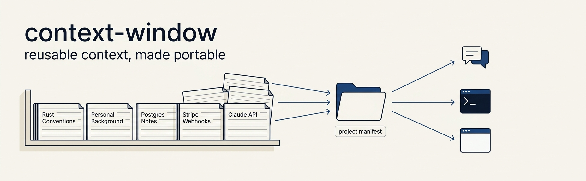
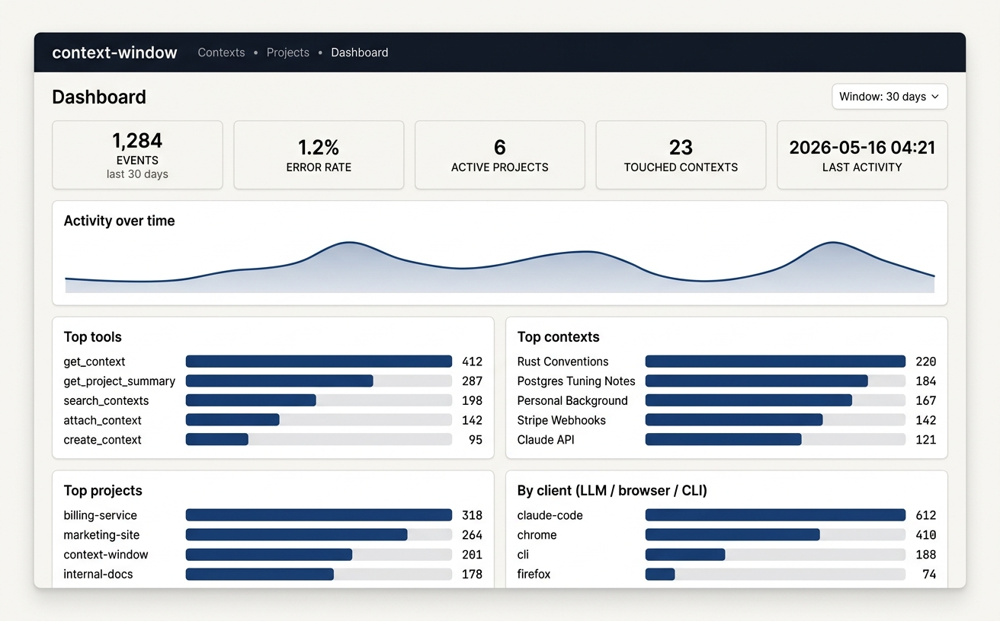

<p align="center">
  
</p>

<p align="center">
  <a href="https://github.com/prodevuk/context-window/actions/workflows/ci.yml"></a>
  <a href="./LICENSE"></a>
  
  
</p>

# context-window

A small, self-hosted tool that helps you build up a **library of reusable context** — and feed exactly the right slice of it to your AI assistants whenever you start a new task.

You write a context once (your coding conventions, your business background, notes on a tricky API). You attach it to as many projects as you like. Claude — or any MCP-aware tool — reads a lightweight manifest, asks for the contexts it needs, and gets to work already up to speed.

There's a **CLI**, a **web UI** (with a usage dashboard), and a built-in **MCP server** that plugs into Claude Code, Claude Desktop, and anything else that speaks the Model Context Protocol.

---

## Why does this exist?

Every time you start a new AI conversation, you tell the model the same things: who you are, how you work, what this project is about, which APIs you care about. That's wasted effort, and it scales poorly the moment you have more than one project.

context-window gives you one place to:

- **Capture** durable knowledge as named, described, tagged contexts (Markdown).
- **Curate** which contexts apply to which project — without copy-pasting.
- **Expose** a single, lightweight manifest to LLMs so they can self-serve the bodies they actually need.
- **See** which contexts and tools are actually being used, by which client.

Everything runs locally on your machine. Your knowledge stays yours.

---

## At a glance



The web dashboard shows every MCP, CLI, and web call recorded over a configurable window — broken down by tool, project, context, and the actual LLM client (Claude, GPT, browser, CLI) that made the call.

---

## Features

- **Two clean entities.** *Contexts* are standalone, reusable, versioned bodies of knowledge. *Projects* are ordered references to contexts plus a manifest file LLMs can read.
- **Local-first.** SQLite + FTS5 search. No accounts, no cloud, no API keys, no network calls (unless you wire your own MCP client to it).
- **MCP server.** 16 tools: `get_project_summary`, `get_context`, `search_contexts`, `create_context`, `attach_context`, `get_context_budget`, `get_usage_stats`, and more.
- **CLI.** Manage contexts and projects from your shell. Idempotent project init that scaffolds a `CLAUDE.md` directive so Claude actually uses the tools.
- **Web UI.** Browse, search, create, edit, archive, and attach contexts. Reorder attached contexts on a project. View a live usage dashboard.
- **Usage analytics.** Every MCP / CLI / web call is recorded with the calling client's name + version. Time-series, top tools, top contexts, error rates.
- **Auto-maintained manifests.** Update a context that's attached to three projects — all three manifests rewrite themselves.
- **Token budgeting.** Ask for the highest-priority subset of contexts that fits a given token budget; everything excluded is reported with a reason.

---

## Quick start

You need **Node ≥ 20**.

### Try it without installing

```bash
npx context-window web        # boots the web UI on http://127.0.0.1:5173
npx context-window --help     # see every command
```

`npx` downloads the package on first run and caches it. The `context-window`,
`context`, and `context-mcp` binaries are all available this way.

### Install it for everyday use

```bash
npm install -g context-window     # puts `context`, `context-window` and `context-mcp` on your PATH
```

### Or build from source

```bash
git clone https://github.com/prodevuk/context-window.git
cd context-window
npm install
npm run build
npm install -g .       # puts `context` and `context-mcp` on your PATH
```

### Capture your first context

```bash
cd /path/to/any/project
context project init -n my-project       # creates the project + a CLAUDE.md directive
context new \
  -n "Rust Conventions" \
  -d "How we write Rust in this codebase" \
  --content-file ./RUST_STYLE.md \
  --category conventions \
  --tags rust,backend \
  --priority important
context project attach <context-id>      # link it to the current project
```

That's it. The project's `.context/manifest.json` is now up to date, and any MCP client pointed at the server will see your context.

### Open the web UI

```bash
context web --port 5173
# → http://127.0.0.1:5173
```

### Register the MCP server with Claude Code

```bash
claude mcp add context-window --scope user context-mcp
```

If you skipped the global install, point it at npx instead:

```bash
claude mcp add context-window --scope user -- npx -y -p context-window context-mcp
```

No `--project-id` is needed — the server auto-detects the active project from the nearest `.context/manifest.json` walking up from your working directory.

Restart Claude Code, and the tools light up.

---

## Concepts

### A **context** is a unit of knowledge

```
id           uuid
name         "Rust Conventions"
description  "How we write Rust in this codebase"   ← what LLMs read first
category     "conventions"
content      "# Rust Conventions\n..."              ← the actual body, in Markdown
tags         ["rust", "backend"]
priority     "important"                            ← critical / important / reference / archived
visibility   "private"                              ← private / shared / public
version      3                                      ← bumped on every update
token_count  1240                                   ← pre-computed; trust it for budgeting
```

A context exists on its own. It is not owned by any project. You can attach the same context to many projects.

### A **project** is a curated list of contexts

A project has a name, a description, an optional root directory, and an **ordered** list of context references. Each reference can override the context's default priority for that project specifically.

### The **manifest** is what your LLM actually reads

Each project owns a `.context/manifest.json` that contains:

- the project's name and description,
- how to talk to the MCP server,
- one entry per attached context (id, name, description, category, priority, token count — **not the content**),
- the total token count of everything attached,
- a short instruction block telling the LLM how to use the available tools.

It's deliberately small so the LLM can read it on every session start without burning a serious slice of its context window.

The body of each context is fetched on demand via `get_context`.

---

## CLI

### Contexts

| Command | What it does |
|---|---|
| `context init` | Create / upgrade the local database |
| `context new` | Create a new context (`-n`, `-d`, `--content` or `--content-file`, plus optional `--category`, `--tags`, `--priority`, `--visibility`) |
| `context list` | List contexts with filters |
| `context search <query>` | Full-text search (FTS5) |
| `context show <id\|prefix>` | Display a context's full content |
| `context edit <id\|prefix>` | Edit content in `$EDITOR` |
| `context archive <id\|prefix>` | Hide a context from manifests + search |
| `context delete <id\|prefix> --yes` | Permanently delete (rare; prefer archive) |
| `context export` / `context import` | Bulk JSON in/out |
| `context stats` | Usage stats with `--scope`, `--tool`, `--context`, `--days` |
| `context web` | Start the web UI |
| `context serve` | Run the stdio MCP server for the current project |
| `context setup` | Add a global Claude directive to `~/.claude/CLAUDE.md` |

### Projects

| Command | What it does |
|---|---|
| `context project init` | Create a project for the current directory, write the manifest, scaffold a `CLAUDE.md` directive |
| `context project list` | List all projects |
| `context project attach <ctx-id>` | Attach a context (idempotent upsert, optional `--position`, `--priority`) |
| `context project detach <ctx-id>` | Detach (the context itself is preserved) |
| `context project contexts` | List contexts attached to the current project |
| `context project manifest` | Regenerate the manifest |
| `context project budget --budget N` | Show which contexts fit a token budget |
| `context project reorder --ids id1,id2,id3` | Re-order attached contexts |

The active project is resolved as: `--project <id>` flag → `CONTEXT_PROJECT_ID` env → nearest `.context/manifest.json` walking up from your cwd.

---

## Web UI

`context web` (default port `5173`) serves an Express app over HTTP on `127.0.0.1`. No login, single user, single machine.

You can:

- Browse, search, view, create, edit, archive, and delete contexts.
- Create and view projects, attach / detach / reorder contexts, override priorities per project.
- See usage stats per context and per project (panel at the bottom of each detail page).
- See the **/dashboard** — five summary cards, an activity-over-time area chart, and bar charts for top tools, top contexts, top projects, and top clients (i.e. which LLM made the call).

The UI is server-rendered HTML with no client-side JavaScript framework. Charts are inline SVG / CSS.

---

## MCP server

The MCP server is a stdio binary, `context-mcp`, that any MCP-aware client can talk to. It exposes 16 tools:

**Reading the project**
- `get_project_summary` — the manifest, freshly built. Call this first.
- `get_context` — full content for one context id.
- `get_contexts_by_category` — filter the attached set by category.
- `list_all_contexts` — every context in the library, regardless of project.
- `search_contexts` — FTS5 search; `scope: "project"` (default) or `"all"`.
- `get_context_budget` — highest-priority subset that fits a given token budget.

**Writing**
- `create_context`, `update_context` (with optional `expected_version` for optimistic locking)
- `archive_context`, `delete_context` (requires `confirm: true`)
- `attach_context`, `detach_context`, `reorder_contexts`
- `create_category`

**Maintenance**
- `regenerate_manifest`
- `get_usage_stats` (scope: project / context / tool / overview)

**Project resolution order:**

1. `--project-id <uuid>` flag
2. `CONTEXT_PROJECT_ID` env var
3. `project_id` of the nearest `.context/manifest.json` walking up from the working directory

Without an active project, only the library-wide tools work (`list_all_contexts`, `get_context`, `create_context`, `search_contexts` with `scope: "all"`).

### Wire it into your client

**Claude Code** — registers globally so it auto-detects the right project per repo:

```bash
claude mcp add context-window --scope user context-mcp
```

**Claude Desktop** (`claude_desktop_config.json`) — Desktop doesn't inherit your shell `PATH`, so use the absolute path that `which context-mcp` prints:

```json
{
  "mcpServers": {
    "context-window": {
      "command": "/Users/you/.nvm/versions/node/v22.7.0/bin/context-mcp"
    }
  }
}
```

### Make Claude actually use it

By default Claude reads tool descriptions but doesn't proactively call tools. `context project init` writes (or appends to) a `CLAUDE.md` file in the project root that tells Claude to call `get_project_summary` at the start of every task. There's also a `context setup` command that adds a one-liner to `~/.claude/CLAUDE.md` so Claude picks up the tool whenever it sees a `.context/manifest.json` in any project.

---

## Architecture

```
src/
├── core/           Business logic, storage-agnostic
├── storage/        Repository interface + SQLite implementation
├── mcp/            Stdio MCP server
├── cli/            commander-based CLI
├── web/            Express HTTP UI + dashboard
└── config/         Path resolution
```

Key invariants (these are what the test suite enforces):

- The manifest on disk is **derived state** — regenerated automatically on every mutation to attached contexts or attachments.
- Contexts with `status !== "active"` are excluded from manifests, budgets, and search.
- Positions in `project_contexts` are normalised to `0..n-1` after any mutation.
- Token counts are computed on **write**, never on read.
- Storage is transport-agnostic; core is UI-agnostic. Throw `DomainError` subclasses; transport layers format them.

A cloud mode (Postgres backend + HTTP transport + multi-tenant auth) is intentionally **not** implemented. The Repository interface is the seam if you want to add one.

---

## Tests

```bash
npm run typecheck                           # strict tsc, no emit
npm run build
node --test tests/services.test.mjs \
            tests/usage.test.mjs            # 10 unit tests over the service layer
node tests/smoke.mjs                        # 27 end-to-end checks spawning the built CLI + stdio MCP
node tests/web-smoke.mjs                    # 30 HTTP checks against every web route
```

All three suites must pass in CI before any change is merged.

---

## Configuration

| Variable | Default | Effect |
|---|---|---|
| `CONTEXT_DB_PATH` | `~/.context-db/context.db` | SQLite file location |
| `CONTEXT_PROJECT_ID` | (none) | Pin a specific project for the MCP server |
| `CONTEXT_WEB_DEBUG` | (unset) | Log full stack traces from the web UI |

---

## For AI coding agents

If you're an LLM working with the context-window MCP server, here's how to use it well.

1. **Start with `get_project_summary`.** It returns enough metadata to decide what to load.
2. **Stay under your budget.** `get_context_budget` returns the highest-priority subset that fits.
3. **Search before asking.** `search_contexts` with `scope: "all"` will tell you whether something is already captured before you re-ask the user.
4. **Capture what you learn.** When the user explains something the next session will need, call `create_context` with a clear name + description and `created_by: "llm:<model>"`. `attach_context` if it's project-specific.
5. **Be conservative with destructive ops.** Prefer `archive_context` over `delete_context`. Use `expected_version` on `update_context` to detect conflicts.

The tool descriptions are intentionally specific. Read them.

---

## Contributing

Contributions are welcome. The project is small enough that a typical change touches one or two files plus a test.

### Setting up

```bash
git clone https://github.com/prodevuk/context-window.git
cd context-window
npm install
npm run build
npm run typecheck
node --test tests/services.test.mjs tests/usage.test.mjs
node tests/smoke.mjs
node tests/web-smoke.mjs
```

Use `npm link` from the project root if you want the global `context` / `context-mcp` binaries to follow your local `dist/` (avoids re-installing after every build).

### Where things live

| You want to… | Open |
|---|---|
| Add an MCP tool | `src/mcp/tools.ts` — the tool is auto-listed via `ListToolsRequestSchema`, no extra wiring |
| Add a CLI command | `src/cli/context-commands.ts` or `src/cli/project-commands.ts` |
| Add a web route | `src/web/server.ts` (and `src/web/views.ts` for HTML) |
| Add a field to Context / Project | `src/core/types.ts` → `src/storage/sqlite/schema.ts` → row mapping in `src/storage/sqlite/sqlite-repository.ts` |
| Change manifest shape | `src/core/manifest-service.ts#build` and the `Manifest` schema in `types.ts` |

### Pull-request checklist

- `npm run typecheck` is clean.
- All three test suites pass (`services` + `usage` unit, `smoke`, `web-smoke`).
- A new tool, CLI command, web route, or invariant has at least one matching assertion in `tests/`.
- User-facing strings (CLI output, MCP tool descriptions, web UI labels, error messages) are in **British English**.
- No new layer / abstraction unless an existing service genuinely cannot accommodate the change.
- Commits are scoped and tell the why, not just the what.

### Issues and discussions

- Use GitHub Issues for bug reports and feature ideas.
- For larger proposals (new transports, new entity types, schema migrations), open a discussion first so we can agree on the shape before code lands.

### Code of conduct

Be kind. Be specific. Assume good faith. We'll add a formal CoC if the project grows beyond a handful of contributors.

---

## Licence

[MIT](./LICENSE) © 2026 Prodevel Ltd.
